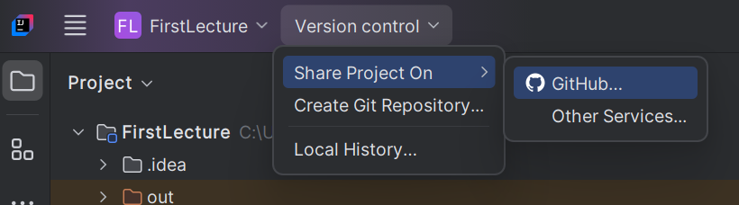
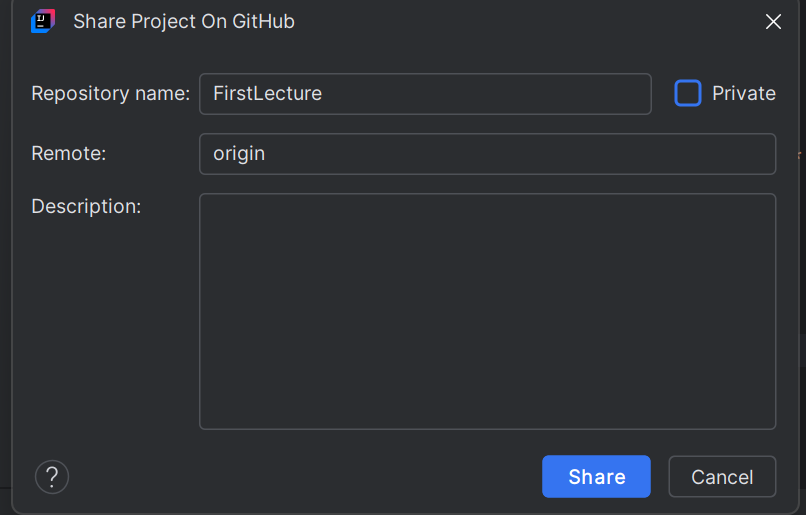
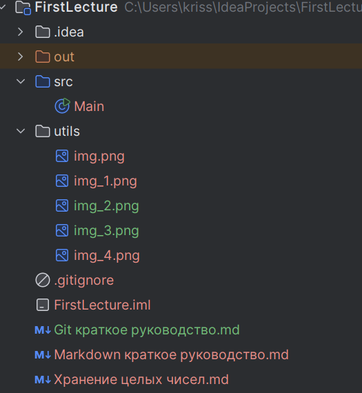

# Краткое руководство по установке и работе с Git

Git — популярная система контроля версий, используемая для отслеживания изменений в коде и совместной работы над проектами.

## Установка Git

### Windows

1. **Скачать установщик:**
   - Перейдите на [официальный сайт Git](https://git-scm.com) и скачайте последнюю версию для Windows.

2. **Установить Git:**
   - Запустите скачанный установщик и следуйте инструкциям. Рекомендуется оставить настройки по умолчанию, чтобы Git интегрировался с командной строкой Windows.

### macOS

1. **Использовать Homebrew:**
   - Установите Homebrew, если он ещё не установлен, затем выполните:
     ```bash
     brew install git
     ```

2. **Или с помощью Xcode:**
   - Введите `git` в терминале. Если Git не установлен, macOS предложит установить Developer Tools.

### Linux

1. **Использовать менеджер пакетов:**
   ```bash
   sudo apt-get install git          # Для дистрибутивов на основе Debian
   sudo yum install git              # Для Fedora, CentOS
   sudo dnf install git              # Для новых версий Fedora
   ```

## Настройка конфигурации Git

После установки Git важно настроить ваше имя пользователя и электронную почту:

```bash
git config --global user.name "Ваше Имя"
git config --global user.email "вашemail@example.com"
```

Чтобы посмотреть все параметры конфигурации, используйте:

```bash
git config --list
```

## Основные команды Git

### Инициализация и клонирование

1. **Инициализация нового репозитория:**
   ```bash
   git init
   ```

2. **Клонирование существующего репозитория:**
   ```bash
   git clone URL_репозитория
   ```

### Отслеживание изменений

3. **Просмотр состояния репозитория:**
   ```bash
   git status
   ```

4. **Добавление изменений в индекс (стейджинг):**
   - Один файл:
     ```bash
     git add имя_файла
     ```
   - Все файлы:
     ```bash
     git add .
     ```

5. **Создание коммита:**
   ```bash
   git commit -m "Сообщение коммита"
   ```

6. **Просмотр истории коммитов:**
   ```bash
   git log
   ```

### Работа с ветками

7. **Просмотр всех веток:**
   ```bash
   git branch
   ```

8. **Создание новой ветки:**
   ```bash
   git branch имя_новой_ветки
   ```

9. **Переключение между ветками:**
   ```bash
   git checkout имя_ветки
   ```

10. **Создание и переключение на новую ветку:**
    ```bash
    git checkout -b имя_новой_ветки
    ```

### Слияние изменений

11. **Слияние веток:**
    - Будучи в ветке, куда нужно слить изменения:
      ```bash
      git merge имя_ветки_для_слияния
      ```

### Работа с удалёнными репозиториями

12. **Просмотр удалённых репозиториев:**
    ```bash
    git remote -v
    ```

13. **Добавление удалённого репозитория:**
    ```bash
    git remote add origin URL_репозитория
    ```

14. **Отправка изменений на удалённый репозиторий:**
    ```bash
    git push origin имя_ветки
    ```

15. **Получение изменений из удалённого репозитория:**
    ```bash
    git pull origin имя_ветки
    ```

# Работа с git из Idea




- Красное - не добавлено в текущий коммит
- Синее - добавлены изменения
- Зеленое - добавлен новый файл


