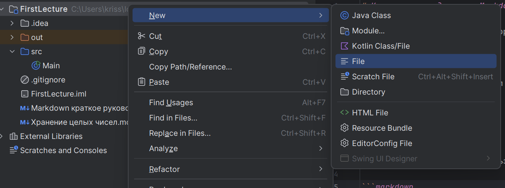
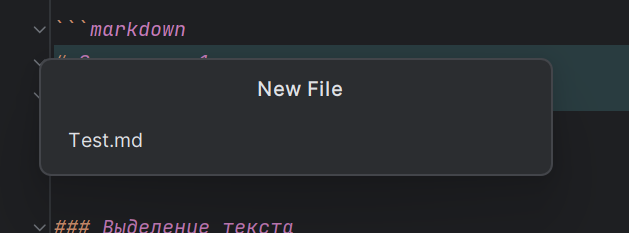

# Краткое руководство по Markdown

Markdown — язык разметки, который преобразует текст в структурированный документ. Он используется для форматирования текста на платформах вроде GitHub, Reddit и других.

## Создание файла

Создаем простой текстовый файл в формате **.md**





## Основные элементы

### Заголовки

Для создания заголовков используйте символ `#`. Количество символов `#` указывает на уровень заголовка (от 1 до 6).

```markdown
# Заголовок 1
## Заголовок 2
### Заголовок 3
```

### Выделение текста

- **Полужирный**: оберните текст двойными звездочками (`**`) или двойными нижними подчеркиваниями (`__`).
  ```markdown
  **Жирный текст**
  __Жирный текст__
  ```

- *Курсив*: оберните текст звездочками (`*`) или нижними подчеркиваниями (`_`).
  ```markdown
  *Курсивный текст*
  _Курсивный текст_
  ```

- ***Комбинированный стиль***: используйте тройные символы.
  ```markdown
  ***Жирный курсив***
  ```

### Списки

- **Маркированные списки**: используйте `*`, `+`, или `-`.
  ```markdown
  - Элемент 1
  - Элемент 2
  ```

- **Нумерованные списки**: используйте цифры с точками.
  ```markdown
  1. Первый элемент
  2. Второй элемент
  ```

### Ссылки

Для создания ссылок используйте квадратные и круглые скобки.
```markdown
[Текст ссылки](https://example.com)
```

### Изображения

Подобно ссылкам, но с восклицательным знаком перед квадратными скобками.
```markdown

```

### Блоки кода

Для встраивания кода используют тройные обратные кавычки (```).
```markdown
```
Пример кода
```
```

Для указания языка программирования:
```markdown
```python
print("Hello, World!")
```
```

### Цитаты

Используйте символ `>` для обозначения цитат.

```markdown
> Это цитата.
```

### Горизонтальная линия

Для вставки линии используйте три или более звездочек, дефисов или подчеркиваний.

```markdown
---
```

## Дополнительные элементы

### Таблицы

Создайте таблицы, используя вертикальные черты (`|`) и дефисы (`-`) для заголовка.

```markdown
| Заголовок 1 | Заголовок 2 |
|-------------|-------------|
| Данные 1    | Данные 2    |
```
| Заголовок 1 | Заголовок 2 |
|-------------|-------------|
| Данные 1    | Данные 2    |
### Списки задач

Добавьте `- [ ]` для невыполненных задач и `- [x]` для выполненных.

```markdown
- [x] Завершенная задача
- [ ] Невыполненная задача
```
- [x] Завершенная задача
- [ ] Невыполненная задача

### Вложение HTML

Markdown поддерживает встраивание HTML-кода напрямую.

```markdown
<br>
```
