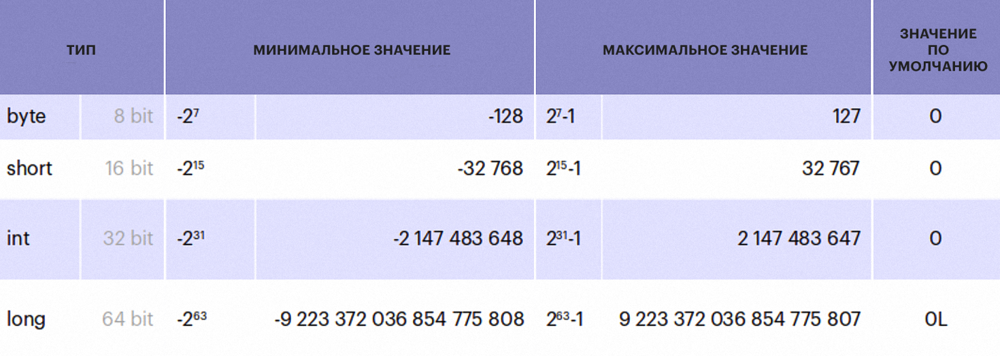

# Хранение целых чисел

Компьютер работает с байтами - базовыми единицами информации

В 1 байте 8 бит, бит имеет 2 состояния 1 и 0, следовательно, байт принимает 2^8 состояний.

Некоторые языки программирования работают с беззнаковыми числами (unsigned int в C++), что не так удобно в реальных
условиях, поэтому 1 бит мы отдаем для знака, следовательно, абсолютное значение числа в 1 байте не превышают 128.

Выделение бита под знак называется знаковым представлением числа.

Наиболее распространенный метод для представления знаковых чисел - дополнительный код (обратный код). Например, в
8-битной системе -1 представляется как 11111111. Стандартная форма записи числа - прямой код.

## Как получить дополнительный код ?

Преобразование числа из прямого кода в дополнительный осуществляется по следующему алгоритму:

1. **Положительное число:** Если старший (знаковый) разряд числа в прямом коде равен 0, то число положительное и
   преобразований не требуется.

2. **Отрицательное число:** Если старший (знаковый) разряд числа в прямом коде равен 1, то число отрицательное. В этом
   случае:
    - Инвертируйте все разряды числа, кроме знакового, чтобы получить обратный код.
    - Прибавьте 1 к полученному числу, чтобы получить дополнительный код.

### Зачем?

Обратный код позволяет заменить операцию вычитания на операцию сложения и сделать операции сложения и вычитания
одинаковыми для знаковых и беззнаковых чисел.

### Пример:

Преобразуем отрицательное число \(-5\), записанное в прямом коде, в дополнительный код.

- **Прямой код** числа \(-5\):  
  `1000 0101`

- **Инверсия разрядов, кроме знакового** (обратный код):  
  `1111 1010`

- **Добавление 1**, чтобы получить дополнительный код:  
  `1111 1011`

## Типы целочисленных данных в Java



## Переполнение

Рассмотрим два кода

```python
a = 1
while a > 0:
    a += 1
```

На python работает очень долго, т.к. не происходит переполнение

```java 
public class Main {
    public static void main(String[] args) {
        int a = 1;
        while (a > 0) {
            a++;
        }
        System.out.println(a);
    }
}
```

На java отрабатывает за (2^31)-1 итераций. Что лежит в переменной a после выполнения цикла, можно увидеть запустив
класс [Main.java](src%2FMain.java)
